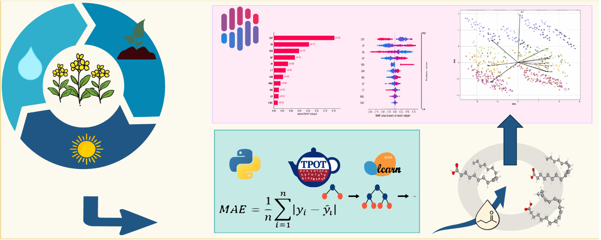

# Automated machine learning Based Prediction of Monounsaturated and Polyunsaturated Fatty Acids in Brassica napus L. Using Field-Level Agronomic Data

# 🌱 Automated ML for *Brassica napus* Fatty-Acid Prediction

  

  <b>AutoML + Explainable AI for predicting rapeseed fatty-acid composition from routine field-level agronomic data.</b>

  

## 🔬 Overview

This repository contains the code for an **automated machine learning and explainable AI workflow** developed to predict seed fatty-acid composition of *Brassica napus* using routinely collected agronomic and physiological measurements.

The workflow combines **TPOT AutoML**, **scikit-learn**, and **SHAP** for automated regression modeling, model evaluation, feature interpretation, and SHAP-guided feature reduction.

### 🎯 Predicted Traits

- **Palmitoleic acid**
- **Oleic acid**
- **Eicosenoic acid**
- **Linoleic acid**
- **α-Linolenic acid**
- **MUFA — Sum of monounsaturated fatty acids**
- **PUFA — Sum of polyunsaturated fatty acids**

### 🧰 Software

| Library | Version |
|---|---:|
| pandas | 2.2.3 |
| numpy | 1.23.0 |
| tpot | 0.12.2 |
| scikit-learn | 1.4.2 |
| shap | 0.45.1 |
| matplotlib | 3.9.0 |
| seaborn | 0.13.2 |

## 📚 Reference

**Shirani Rad, A. H., & Shiranirad, S.**  
*Automated machine learning based prediction of monounsaturated and polyunsaturated fatty acids in Brassica napus L. using field-level agronomic data.*  
**Industrial Crops & Products, 245 (2026), 123309.**

  

